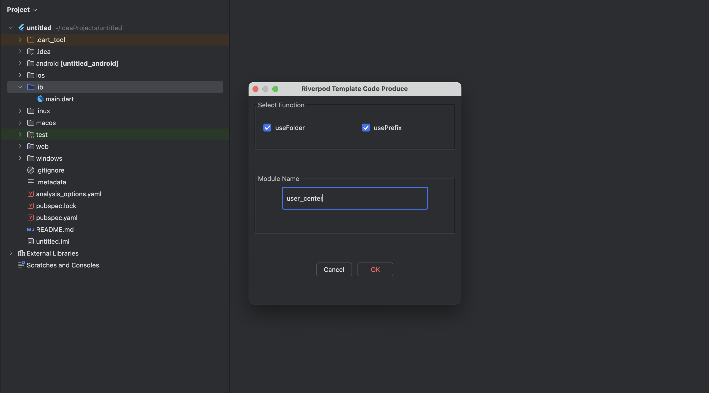
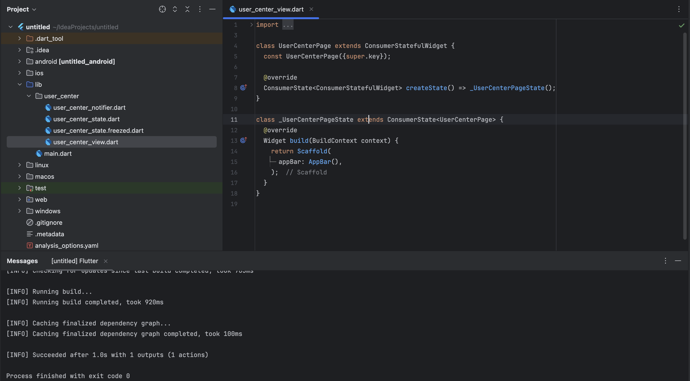

# FlutterRiverpod

## Description

<!-- Plugin description -->

**The plug-in is only available for projects with [flutter_riverpod](https://pub.dev/packages/flutter_riverpod)
and [freezed](https://pub.dev/packages/freezed)**

1. Used to generate the template code of provider framework
2. Right-click the File: New -> Flutter Provider
3. Use Flutter Run Build Runner

## Feature

1. [x] create folder or file
2. [ ] auto add riverpod、freezed if no add
3. [ ] add build script

<!-- Plugin description end -->

